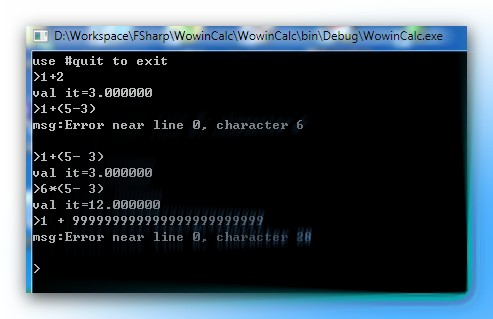

+++
title = "fslex和fsyacc的简单应用：四则运算"
date=2010-07-21

[taxonomies]
categories=["Programming"]
tags=["Programming", "F#"]
+++
定义词法规则:

Lexer.fsl
```f#
{
module wowin.Lexer
open System
open Microsoft.FSharp.Text.Lexing

open wowin.Parser
}
let num = ['0'-'9']+
let intNum = '-'? num
let floatNum = '-'? num ('.' num)? (['e' 'E'] num)?
let whitespace = ' ' | '\t'
let newline = '\n' | '\r' '\n'
rule token = parse
| intNum { INT (int (new String(lexbuf.Lexeme))) }
| floatNum { FLOAT (float (new String(lexbuf.Lexeme))) }
| '(' { LPAREN}
| ')' { RPAREN}
| '+' { ADD }
| '-' { SUB }
| '*' { MUL }
| '/' { DIV }
| whitespace { token lexbuf }
| newline { token lexbuf }
| eof { EOF }
| _ { failwithf "unrecognized input: '%s'" (new String(lexbuf.Lexeme)) }
```
 

通过命令 fslex Lexer.fsl --unicode 生成Lexer.fs文件。默认生成Lexer是LexBuffer<byte>类型，使用--unicode程序处理unicode文件，是LexBuffer<char>类型

 
定义语法树：

Ast.fs
```f#
module wowin.Ast
type expr =
| Int of int
| Float of float
| Add of expr * expr
| Sub of expr * expr
| Mul of expr * expr
| Div of expr * expr

 
定义语法规则：

Parser.fsy
%{
open wowin.Ast
%}

// The start token becomes a parser function in the compiled code.
%start start

// These are the terminal tokens of the grammar along with the types of
// the data carried by each token:
%token <int> INT
%token <float> FLOAT
%token ADD SUB MUL DIV
%token LPAREN RPAREN
%token EOF

// Associativity and Precedences - Lowest precedence comes first
%left ADD SUB
%left MUL DIV

// This is the type of the data produced by a successful reduction
// of the 'start' symbol:
%type <wowin.Ast.expr> start

%%

start: Expr EOF { $1 }
Expr:
| Expr ADD Expr { Add ($1, $3) }
| Expr SUB Expr { Sub ($1, $3) }
| Expr MUL Expr { Mul ($1, $3) }
| Expr DIV Expr { Div ($1, $3) }
| FLOAT { Float $1 }
| INT { Int $1 }
| LPAREN Expr RPAREN { $2 }
```

通过命令 fsyacc Parser.fsy --module wowin.Parser 生成Parser.fs和Parser.fsi文件。--module选项是为了指定生成的Parser的模块名称。

 
主程序：

Program.fs
```f#
module main
open System
open Microsoft.FSharp.Text.Lexing
open wowin.Ast

//解析表达式
let parseText text =
let lexbuf = LexBuffer<_>.FromString text
try
wowin.Parser.start wowin.Lexer.token lexbuf
with e ->
let pos = lexbuf.EndPos
failwithf "Error near line %d, character %d\n" pos.Line pos.Column

//计算表达式
let rec evalExpr(exp:wowin.Ast.expr):float =
match exp with
| Int v -> float v
| Float v -> v
| Add(lft,rgt) -> (evalExpr lft) + (evalExpr rgt)
| Sub(lft,rgt) -> (evalExpr lft) - (evalExpr rgt)
| Mul(lft,rgt) -> (evalExpr lft) * (evalExpr rgt)
| Div(lft,rgt) -> (evalExpr lft) / (evalExpr rgt)

[< EntryPoint >]
let main args=
let rec loop(detail)=
printf ">"
let line = Console.ReadLine()
match line with
| "#quit" -> ()
| _ ->
try
let exp = parseText line
evalExpr exp
|>printfn "val it=%f"
if detail then
printfn "\texpr=%A" exp
with
| ex ->
printfn "msg:%s" ex.Message
loop(detail)
let start detail =
printfn "use #quit to exit"
loop(detail)
if args.Length > 0 then
match args.[0] with
| "--detail" | "-d" ->
start(true)
| "--help" | "-h" ->
printfn "wowin calc\r\n\
\toptions:\r\n\
\t--detail:print expression tree\r\n\
\t--help:show help\r\n\
\t-d:short for --detail\r\n\
\t-h:short for -- help"
| _ -> start(false)
else
start(false)
0
```
 

运行截图：



问题：

- 表达式中有减法运算时，如果 - 紧跟着数字，它们一起被识别成了负数，这样就产生了错误。

---
从我的百度空间导入