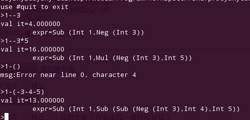

+++
title = "fslex和fsyacc的简单应用：四则运算(续)"
date=2010-07-22

[taxonomies]
categories=["Programming"]
tags=["Programming", "F#"]
+++
上一篇文章中有一个有遗留问题:就是负号的处理。
导致1-3不能识别的原因是1识别为一个token，-3识别为一个token，这样就不符合语法规则中定义的任何一条规则。
现在重新定义词法规则，不把负号和数字当作一个整体，负号留在语法规则中处理。
Lexer.fsl内容如下：
```f#
{
module wowin.Lexer
open System
open Microsoft.FSharp.Text.Lexing

open wowin.Parser
}
let num        = ['0'-'9']+
let intNum     = num
let floatNum   = num ('.' num)? (['e' 'E'] num)?
let whitespace = ' ' | '\t'
let newline    = '\n' | '\r' '\n'
rule token = parse
| intNum     { INT (int (new String(lexbuf.Lexeme))) }
| floatNum   { FLOAT (float (new String(lexbuf.Lexeme))) }
| '('        { LPAREN}
| ')'        { RPAREN}
| '+'        { ADD }
| '-'        { SUB }
| '*'        { MUL }
| '/'        { DIV }
| whitespace { token lexbuf }
| newline    { token lexbuf }
| eof        { EOF }
| _          { failwithf "unrecognized input: '%s'" (new String(lexbuf.Lexeme)) }
```

重新定义语法树，增加负数表达式。Ast.fs内容如下：
```f#
module wowin.Ast
type expr =
| Int of int
| Float of float
| Add of expr * expr
| Sub of expr * expr
| Mul of expr * expr
| Div of expr * expr
| Neg of expr
```

在语法规则中，将使用%prec terminal的语法来定义基于上下文的优先级。在语法规则中使用了一个不实际存在的USUB，%left USUB 指定它具有最高的优先级，将会优先识别SUB Expr。Parser.fsy内容如下：
```f#
%{
open wowin.Ast
%}

// The start token becomes a parser function in the compiled code.
%start start

// These are the terminal tokens of the grammar along with the types of
// the data carried by each token:
%token <int> INT
%token <double> FLOAT
%token ADD SUB MUL DIV
%token LPAREN RPAREN
%token EOF

// Associativity and Precedences - Lowest precedence comes first
%left ADD SUB
%left MUL DIV
%left USUB

// This is the type of the data produced by a successful reduction
// of the 'start' symbol:
%type <wowin.Ast.expr> start

%%

start: Expr EOF                  { $1 }
Expr:
| Expr ADD Expr              { Add ($1, $3) }
| Expr SUB Expr              { Sub ($1, $3) }
| Expr MUL Expr              { Mul ($1, $3) }
| Expr DIV Expr              { Div ($1, $3) }
| FLOAT                      { Float $1 }
| INT                        { Int $1 }
| LPAREN Expr RPAREN         { $2 }
| SUB Expr %prec USUB        { Neg $2 } //负数
```

修改Program.fs中的evalExpr函数，增加对负数的处理：
```f#
let rec evalExpr(exp:wowin.Ast.expr):float =
match exp with  
| Int v -> float v
| Float v -> v
| Add(lft,rgt) -> (evalExpr lft) + (evalExpr rgt)
| Sub(lft,rgt) -> (evalExpr lft) - (evalExpr rgt)
| Mul(lft,rgt) -> (evalExpr lft) * (evalExpr rgt)
| Div(lft,rgt) -> (evalExpr lft) / (evalExpr rgt)
| Neg(e) -> -evalExpr(e)
```

现在运行程序可以看到它完全正常工作了。



参考：[Ocalmlyacc Tutorial](http://plus.kaist.ac.kr/~shoh/ocaml/ocamllex-ocamlyacc/ocamlyacc-tutorial/sec-context-dependent-precedence.html)

---
从我的百度空间导入