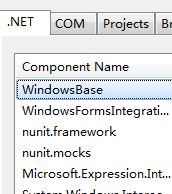
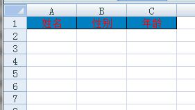
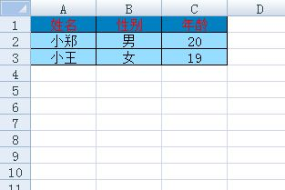

+++
title = "使用Simple OOXML简化Open Xml操作"
date=2009-11-14

[taxonomies]
categories=["Programming"]
tags=["c#", "open xml", "excel"]
+++

[Simple OOXml](http://simpleooxml.codeplex.com/)是CodePlex上的一个开源项目，使用[Open Xml SDK 2.0](http://www.microsoft.com/downloads/details.aspx?FamilyId=C6E744E5-36E9-45F5-8D8C-331DF206E0D0) ，封装了一系列读写.docx和.xlsx文档的类，可以很大程度上简化工作。

首先必须下载Simple OOXml和Open Xml SDK 2.0。

其次，在项目中添加对`WindowsBase.dll`的引用；添加对`DocumentFormat.OpenXml.dll`的引用；添加对`DocumentFormat.OpenXml.Extensions.dll`的引用。



一、新建一个.xlsx文档，代码如下：
```c#

            //加载空白.xlsx文件到内存中(DocumentFormat.OpenXml.Extensions中的内嵌资源)
            using (var stream = SpreadsheetReader.Create())
            {
                using (var doc = SpreadsheetDocument.Open(stream, true))
                {
                    var sheet = SpreadsheetReader.GetWorksheetPartByName(doc, "Sheet1");
                    var writer = new WorksheetWriter(doc, sheet);

                    //获取默认样式
                    var style1 = SpreadsheetStyle.GetDefault(doc);
                    style1.SetBackgroundColor("0080C0");//设置背景颜色
                    style1.SetHorizontalAlignment(HorizontalAlignmentValues.Center);//设置水平居中对齐
                    style1.SetColor("FF0000");//设置颜色
                    style1.SetBorder("000000", BorderStyleValues.Thin);//设置边框
                    var headers =new []{"姓名","性别","年龄"};
                    for (int i = 0; i < headers.Length; i++)
                    {
                        var columnName = SpreadsheetReader.GetColumnName("A", i);//获取列名
                        writer.PasteText(columnName + "1", headers[i], style1);//写入到单元格
                    }
                    writer.Save();//在内存中保存文档结构
                    SpreadsheetWriter.StreamToFile("test.xlsx", stream);//保存到文件中
                }
            }
```
可以看到效果如下图所示：



二，打开已存在的.xlsx文件写入数据，代码如下：
```c#

            using (var stream = SpreadsheetReader.StreamFromFile("test.xlsx"))
            {
                using (var doc = SpreadsheetDocument.Open(stream, true))
                {
                    var sheet = SpreadsheetReader.GetWorksheetPartByName(doc, "Sheet1");
                    var writer = new WorksheetWriter(doc, sheet);

                    //获取默认样式
                    var style1 = SpreadsheetStyle.GetDefault(doc);
                    style1.SetBackgroundColor("97DDFF");//设置背景颜色
                    style1.SetHorizontalAlignment(HorizontalAlignmentValues.Center);//设置水平居中对齐
                    style1.SetBorder("000000", BorderStyleValues.Thin);//设置边框
                    var data = new[] {
                        new {Name = "小郑",Sex = "男",Age = 20},
                        new {Name = "小王",Sex = "女",Age = 19}
                    };

                    int rowIndex = 2;
                    for (int i = 0; i < data.Length; i++)
                    {
                        writer.PasteText("A" + rowIndex, data[i].Name, style1);//写入姓名
                        writer.PasteText("B" + rowIndex, data[i].Sex, style1);//写入性别
                        writer.PasteNumber("C" + rowIndex, data[i].Age.ToString(), style1);//写入年龄
                        rowIndex++;
                    }
                    writer.Save();//在内存中保存文档结构
                    SpreadsheetWriter.StreamToFile("test.xlsx", stream);//保存到文件中
                }
            }
```

可以看到效果如下图所示：



通过以上两个示例，可以看出操作很简单。

这样就可以根据需要，定制不同的模板，产生需要的报表。

在使用的过程中还有以下问题需要注意：

1.如果有跨越多列合并的单元格，插入行操作时，此单元格中的数据会向下移动，但是此单元格不会变动。

2.如果模板文件是通过.xls另存为操作转换成.xlsx文件，在进行 `writer.Save()`操作时会报错，这个可能是个BUG，使用时需要注意。

---
从我的百度空间导入