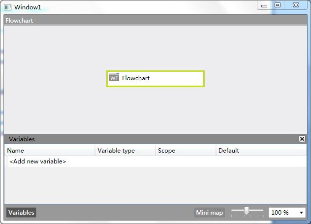

+++
title = "[WF4.0]工作流设计器Rehosting（二）"
date=2009-06-28

[taxonomies]
categories=["Programming"]
tags=["workflow", ".Net"]
+++
## 索引
- [[WF4.0]工作流设计器Rehosting（一）](@/blog/it/wf/wf4-designer-rehosting-1.md)
- [[WF4.0]工作流设计器Rehosting（二）](@/blog/it/wf/wf4-designer-rehosting-2.md)
- [[WF4.0]工作流设计器Rehosting（三）](@/blog/it/wf/wf4-designer-rehosting-3.md)


## 正文
新建一个WPf应用程序项目，

Window1.xaml
```xml

<Window x:Class="WF4Designer.Window1"

       xmlns="http://schemas.microsoft.com/winfx/2006/xaml/presentation"

       xmlns:x="http://schemas.microsoft.com/winfx/2006/xaml"

       Title="Window1" Height="300" Width="300">

    <Grid x:Name="gridview">

       

    </Grid>

</Window>
```

Window1.xaml.cs
```c#

using System.Collections.Generic;

using System.Linq;

using System.Text;

using System.Windows;

using System.Windows.Controls;

using System.Windows.Data;

using System.Windows.Documents;

using System.Windows.Input;

using System.Windows.Media;

using System.Windows.Media.Imaging;

using System.Windows.Navigation;

using System.Windows.Shapes;

using System.Activities.Design;

using System.Activities.Statements;

namespace WF4Designer

{

    /// <summary>

    /// Interaction logic for Window1.xaml

    /// </summary>

    public partial class Window1 : Window

    {

        public Window1()

        {

            InitializeComponent();

            AddDesigner();

        }

        private void AddDesigner()

        {

            var wd = new WorkflowDesigner();

            wd.Load(new Flowchart());

            gridview.Children.Add(wd.View);

        }

   }

}
```

演示界面截图：


现在还不能进行设计，还没有添加工具箱和PropertyGrid视图。

---
从我的百度空间导入