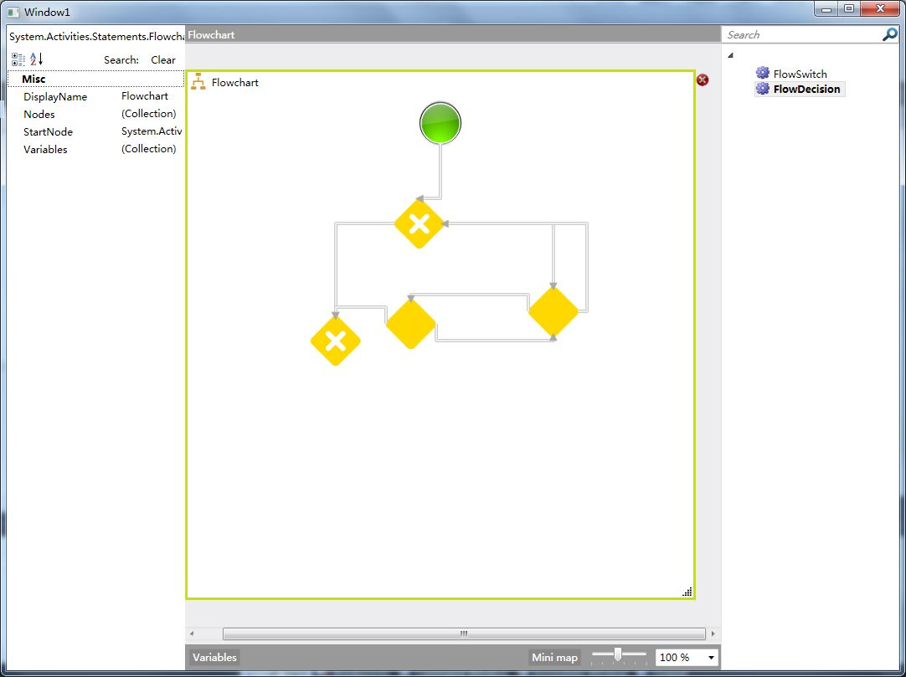

+++
title = "[WF4.0]工作流设计器Rehosting（三）"
date=2009-06-28

[taxonomies]
categories=["Programming"]
tags=["workflow", ".Net"]
+++

## 索引
- [[WF4.0]工作流设计器Rehosting（一）](@/blog/it/wf/wf4-designer-rehosting-1.md)
- [[WF4.0]工作流设计器Rehosting（二）](@/blog/it/wf/wf4-designer-rehosting-2.md)
- [[WF4.0]工作流设计器Rehosting（三）](@/blog/it/wf/wf4-designer-rehosting-3.md)


## 正文

可以看到工具箱和属性窗口，但是不能进行拖放设计，还需要注册活动外观，让设计器知道如何响应相关操作，修改Window1.xaml.cs文件

```c#
using System;

using System.Collections.Generic;

using System.Linq;

using System.Text;

using System.Windows;

using System.Windows.Controls;

using System.Windows.Data;

using System.Windows.Documents;

using System.Windows.Input;

using System.Windows.Media;

using System.Windows.Media.Imaging;

using System.Windows.Navigation;

using System.Windows.Shapes;

using System.Activities.Design;

using System.Activities.Design.Metadata;

using System.Activities.Statements;

using System.ComponentModel;

using System.Activities.Core.Design;

namespace WF4Designer

{

    /// <summary>

    /// Interaction logic for Window1.xaml

    /// </summary>

    public partial class Window1 : Window

    {

        public Window1()

        {

            InitializeComponent();

            AddDesigner();

        }

        private void AddDesigner()

        {

            //注册活动外观

            //var builder = new AttributeTableBuilder();

            //builder.AddCustomAttributes(typeof(Flowchart),

            //                 new DesignerAttribute(typeof(SequenceDesigner)));

            //MetadataStore.AddAttributeTable(builder.CreateTable());

            new DesignerMetadata().Register();

            var wd = new WorkflowDesigner();

            wd.Load(new Flowchart());

            Grid.SetColumn(wd.View, 1);

            gridview.Children.Add(wd.View);

            ToolboxControl toolbox = new ToolboxControl();

            toolbox.Categories.Add(new ToolboxCategoryItemsCollection

                {

                    new ToolboxItemWrapper(typeof(FlowSwitch)),

                    new ToolboxItemWrapper(typeof(FlowDecision))

                });

            gridview.Children.Add(toolbox);

            Grid.SetColumn(toolbox, 2);

            Grid.SetColumn(wd.PropertyInspectorView, 0);

            gridview.Children.Add(wd.PropertyInspectorView);

           

        }

    }

}
```

现在能够进行拖放操作了，需要注意的是必须在加载工作流之前注册外观元数据，否则不起作用；另外没有找到FlowchartDesigner，不知道用哪一个Designer来对应Flowchart，还好在[MSDN论坛](http://social.msdn.microsoft.com/Forums/en-US/wfprerelease/thread/e321cfff-706d-4d8e-860e-f2d83a84e0b4)上看到有人解答了，使用new DesignerMetadata().Register()注册所有Designer，这样可以Rehosting Flowchart工作流。 



---
从我的百度空间导入