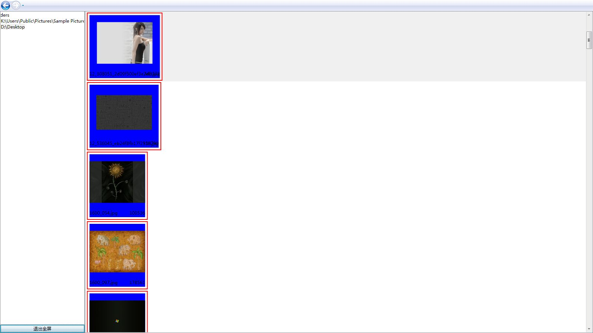
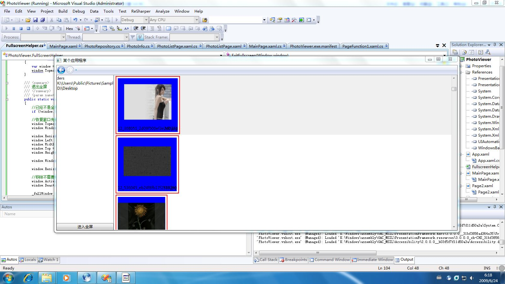

+++
title = "Wpf应用程序进入全屏和退出全屏"
date=2009-06-24

[taxonomies]
categories=["Programming"]
tags=["WPF", ".Net", "c#", "fullscreen"]
+++
因为想尝试一下使Wpf应用程序的全屏状态，但是Wpf没有全屏操作的直接实现，在网上搜索一下，发现很多都是使用pinvoke调用win32动态链接库来实现，而且功能也不全，当发现参考文章中的内容时，发现了全屏的简单方法，而且也不用使用Pinvoke，随即修改和完善了功能，代码如下：
```c#

using System;
using System.Windows;
using System.Windows.Forms;
using System.Windows.Interop;

namespace PhotoViewer
{
    /// <summary>
    /// Wpf应用程序全屏辅助类
    ///
    /// ——全部使用.Net类进行操作
    /// ——可进入全屏和退出全屏
    /// ——可恢复到全屏前的状态
    /// ——全屏时可切换到其他应用程序
    ///
    /// </summary>
    public static class FullScreenHelper
    {
        private static Window _fullWindow;
        private static WindowState _windowState;
        private static WindowStyle _windowStyle;
        private static bool _windowTopMost;
        private static ResizeMode _windowResizeMode;
        private static Rect _windowRect;

        /// <summary>
        /// 进入全屏
        /// </summary>
        /// <param name="window"></param>
        public static void GoFullscreen(this Window window)
        {
            //已经是全屏
            if(window.IsFullscreen()) return;

            //存储窗体信息
            _windowState = window.WindowState;
            _windowStyle = window.WindowStyle;
            _windowTopMost = window.Topmost;
            _windowResizeMode = window.ResizeMode;
            _windowRect.X = window.Left;
            _windowRect.Y = window.Top;
            _windowRect.Width = window.Width;
            _windowRect.Height = window.Height;


            //变成无边窗体
            window.WindowState = WindowState.Normal;//假如已经是Maximized，就不能进入全屏，所以这里先调整状态
            window.WindowStyle = WindowStyle.None;
            window.ResizeMode = ResizeMode.NoResize;
            window.Topmost = true;//最大化后总是在最上面

            //获取窗口句柄
            var handle = new WindowInteropHelper(window).Handle;

            //获取当前显示器屏幕
            Screen screen = Screen.FromHandle(handle);

            //调整窗口最大化,全屏的关键代码就是下面3句
            window.MaxWidth = screen.Bounds.Width;
            window.MaxHeight = screen.Bounds.Height;
            window.WindowState = WindowState.Maximized;
           

            //解决切换应用程序的问题
            window.Activated += new EventHandler(window_Activated);
            window.Deactivated += new EventHandler(window_Deactivated);

            //记住成功最大化的窗体
            _fullWindow = window;
        }

        static void window_Deactivated(object sender, EventArgs e)
        {
            var window = sender as Window;
            window.Topmost = false;
        }

        static void window_Activated(object sender, EventArgs e)
        {
            var window = sender as Window;
            window.Topmost = true;
        }

        /// <summary>
        /// 退出全屏
        /// </summary>
        /// <param name="window"></param>
        public static void ExitFullscreen(this Window window)
        {
            //已经不是全屏无操作
            if (!window.IsFullscreen()) return;

            //恢复窗口先前信息，这样就退出了全屏
            window.Topmost = _windowTopMost;
            window.WindowStyle = _windowStyle;

            window.ResizeMode = ResizeMode.CanResize;//设置为可调整窗体大小
            window.Left = _windowRect.Left;
            window.Width = _windowRect.Width;
            window.Top = _windowRect.Top;
            window.Height = _windowRect.Height;

            window.WindowState = _windowState;//恢复窗口状态信息

            window.ResizeMode = _windowResizeMode;//恢复窗口可调整信息

            //移除不需要的事件
            window.Activated -= window_Activated;
            window.Deactivated -= window_Deactivated;

            _fullWindow = null;
        }

        /// <summary>
        /// 窗体是否在全屏状态
        /// </summary>
        /// <param name="window"></param>
        /// <returns></returns>
        public static bool IsFullscreen(this Window window)
        {
            if(window==null)
            {
                throw new ArgumentNullException("window");
            }
            return _fullWindow == window;
        }
    }
}
```

还有一个不爽的问题是，在最大化时如果已经是最大化状态，必须先退出最大化状态，造成多闪烁一次，目前还没有找到解决方法。

演示程序截图

非全屏状态：


全屏状态：


## 参考文章
- http://www.swart.ws/2009/03/kiosk-full-screen-wpf-applications.html

---
从我的百度空间导入