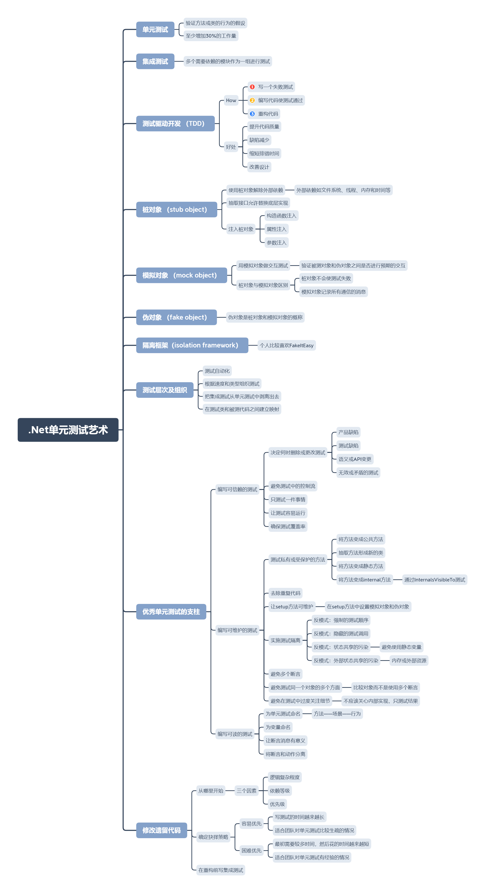

+++
title = "读书：《.Net单元测试的艺术》"
date=2020-06-06

[taxonomies]
categories=["Reading"]
tags=["Programming", "Unit Test", "Testing"]
+++

中文：.Net单元测试的艺术

英文：The Art of Unit Testing: With Examples in .Net

[查看原图](mind.png)

